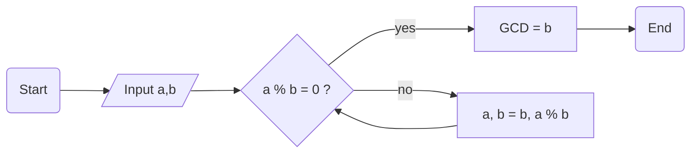

# Markdown Learning

## I. Basic syntax

#### 1. Header <div style="color: red;">(Intelligent keyword suggestion: header)</div>

```markdown
# First Level

Same as First Level
===

## Second Level

Same as Second Level
---

### Third Level
#### Fourth Level
##### Fifth Level
###### Sixth Level
```

# First Level

Same as First Level
===

## Second Level

Same as Second Level
---

### Third Level
#### Fourth Level
##### Fifth Level
###### Sixth Level

> [!note]
> 
> There needs to be a space between the # symbol and the title content!

#### 2. Paragraph <div style="color: red;">(Intelligent keyword suggestion of line break: br)</div>

```markdown
Common paragraph.

Wrap line\
paragraph.

Another wrap line<br>paragraph.
```

Common paragraph.

Wrap line\
paragraph.

Another wrap line<br>paragraph.

#### 3. Emphasize
<h4 style="color: red;">(Intelligent keyword suggestion of font bold: strong)</h4>
<h4 style="color: red;">(Intelligent keyword suggestion of font italic: italic)</h4>
<h4 style="color: red;">(Intelligent keyword suggestion of highlight: light)</h4>
<h4 style="color: red;">(Intelligent keyword suggestion of delete line: delete)</h4>
<h4 style="color: red;">(Intelligent keyword suggestion of underline: underline)</h4>
<h4 style="color: red;">(Intelligent keyword suggestion of superscript: sup)</h4>
<h4 style="color: red;">(Intelligent keyword suggestion of subscript: sub)</h4>

```markdown
These are **bold**, *italic*, ==highlight==, ~~delete~~, <u>underline</u>, <sup>sup</sup>, <sub>sub</sub>.
```

These are **bold**, *italic*, ==highlight==, ~~delete~~, <u>underline</u>, <sup>sup</sup>, <sub>sub</sub>.

#### 4. Quote
<h4 style="color: red;">(Intelligent keyword suggestion: quote)</h4>

```markdown
> Common quote

> [!tip]
> Tip quote

> [!note]
> Note quote

> [!warning]
> Warning quote

> [!caution]
> Caution quote
```

> Common quote

> [!tip]
> Tip quote

> [!note]
> Note quote

> [!warning]
> Warning quote

> [!caution]
> Caution quote

#### 5. List
<h4 style="color: red;">(Intelligent keyword suggestion: list)</h4>

```markdown
1. Ordered 1
2. Ordered 2
   1. Sub 1
   2. Sub 2
   3. Sub 3
3. Ordered 3

+ Non-order 1
+ Non-order 2
    + Non-order 3
+ Non-order 4

- Non-order 1
- Non-order 2
    - Non-order 3
- Non-order 4

* Non-order 1
* Non-order 2
    * Non-order 3
* Non-order 4

- [ ] Mission 1
- [x] Mission 2
    - [ ] Mission 3
- [ ] Mission 4
```

1. Ordered 1
2. Ordered 2
    1. Sub 1
    2. Sub 2
    3. Sub 3
3. Ordered 3

+ Non-order 1
+ Non-order 2
    + Non-order 3
+ Non-order 4

- Non-order 1
- Non-order 2
    - Non-order 3
- Non-order 4

* Non-order 1
* Non-order 2
    * Non-order 3
* Non-order 4

- [ ] Mission 1
- [x] Mission 2
    - [ ] Mission 3
- [ ] Mission 4

#### 6. Table
<h4 style="color: red;">(Intelligent keyword suggestion: table)</h4>

```markdown
| Head 1     | Head 2    | Head 3    |
|----------|---------|----------|
| Content 1-1   | Content 1-2  | Content 1-3  |
| Content 2-1   | Content 2-2  | Content 2-2  |
| Content 3-1   | Content 3-2  | Content 3-2  |

| Left 1     | Center 2    | Right 3    |
|:----------|:---------:|----------:|
| Left 1-1   | Center 1-2  | Right 1-3  |
| Left 2-1   | Center 2-2  | Right 2-2  |
| Left 3-1   | Center 3-2  | Right 3-2  |
```

| Head 1     | Head 2    | Head 3    |
|----------|---------|----------|
| Content 1-1   | Content 1-2  | Content 1-3  |
| Content 2-1   | Content 2-2  | Content 2-2  |
| Content 3-1   | Content 3-2  | Content 3-2  |

| Left 1     | Center 2    | Right 3    |
|:----------|:---------:|----------:|
| Left 1-1   | Center 1-2  | Right 1-3  |
| Left 2-1   | Center 2-2  | Right 2-2  |
| Left 3-1   | Center 3-2  | Right 3-2  |

#### 7. Code
<h4 style="color: red;">(Intelligent keyword suggestion: code)</h4>

````markdown
This is an inline code `console.log("Hello World");`.

```javascript
// This is a code block.
function method(arg) {
    console.log(arg);
}

method("Hello World");
```
````

This is an inline code `console.log("Hello World");`.

```javascript
// This is a code block.
function method(arg) {
    console.log(arg);
}

method("Hello World");
```

#### 8. Separator line
<h4 style="color: red;">(Intelligent keyword suggestion: line)</h4>

```markdown
***
Gap1

---
Gap2

___
```

***
Gap1

---
Gap2

___

#### 9. Link
<h4 style="color: red;">(Intelligent keyword suggestion: link)</h4>

```markdown
[Subscribe now! Follow Scott_Smith. Thank you!](https://space.bilibili.com/435780464)
```

[Subscribe now! Follow Scott_Smith. Thank you!](https://space.bilibili.com/435780464)

Of course, you can also embed images so that users can click on the image to jump to a link.

```markdown
[](https://space.bilibili.com/435780464)
```

[](https://space.bilibili.com/435780464)

#### 10. Image
<h4 style="color: red;">(Intelligent keyword suggestion: img)</h4>

```markdown

```


## II. Advanced syntax

#### 1. HTML

The HTML content is quite extensive; you can visit [RUNOOB](https://www.runoob.com/html/html-tutorial.html) for further learning, as it supports Markdown rendering to produce richer and more complex effects.

For example, if you want to render more complex tables, such as those with merged cells, ordinary Markdown statements may not be able to do it.

However, it can be rendered using HTML.

```html
<table>
    <tr>
        <th rowspan="2">序号</th>
        <th rowspan="2">监测位置</th>
        <th rowspan="2">供电通路</th>
        <th rowspan="2">供电电压</th>
        <th rowspan="2">负载电流</th>
        <th rowspan="2">雷击次数</th>
        <th rowspan="2">最近一次雷击时间</th>
        <th colspan="2">后备保护空开状态</th>
        <th rowspan="2">SPD损害数量</th>
        <th colspan="2">输出空开状态</th>
    </tr>
    <tr>
        <th>B级</th>
        <th>C级</th>
        <th>1路</th>
        <th>2路</th>
    </tr>
    <tr> <th rowspan="4">1</th>
    </tr>
    <tr>
        <td>1</td>
        <td>78</td>
        <td>96</td>
        <td>67</td>
        <td>98</td>
        <td>88</td>
        <td>75</td>
        <td>94</td>
        <td>69</td>
        <td>23 </td>
        <td>33 </td>
    </tr>
    <tr>
        <th colspan="2">提示建议</th>
        <th colspan="2">智能防雷箱状态</th>
        <th colspan="2">防雷箱型号</th>
        <th colspan="3">防雷箱序列号</th>
        <th colspan="2">防雷箱版本</th>
    </tr>
    <tr>
        <td colspan="2">建议整机按规程检测</td>
        <td colspan="2">在线</td>
        <td colspan="2">2018041201-035PF</td>
        <td colspan="3">2018041201-256</td>
        <td colspan="2">V1.0.0</td>
    </tr>
</table>
```

<table>
    <tr>
        <th rowspan="2">序号</th>
        <th rowspan="2">监测位置</th>
        <th rowspan="2">供电通路</th>
        <th rowspan="2">供电电压</th>
        <th rowspan="2">负载电流</th>
        <th rowspan="2">雷击次数</th>
        <th rowspan="2">最近一次雷击时间</th>
        <th colspan="2">后备保护空开状态</th>
        <th rowspan="2">SPD损害数量</th>
        <th colspan="2">输出空开状态</th>
    </tr>
    <tr>
        <th>B级</th>
        <th>C级</th>
        <th>1路</th>
        <th>2路</th>
    </tr>
    <tr> <th rowspan="4">1</th>
    </tr>
    <tr>
        <td>1</td>
        <td>78</td>
        <td>96</td>
        <td>67</td>
        <td>98</td>
        <td>88</td>
        <td>75</td>
        <td>94</td>
        <td>69</td>
        <td>23 </td>
        <td>33 </td>
    </tr>
    <tr>
        <th colspan="2">提示建议</th>
        <th colspan="2">智能防雷箱状态</th>
        <th colspan="2">防雷箱型号</th>
        <th colspan="3">防雷箱序列号</th>
        <th colspan="2">防雷箱版本</th>
    </tr>
    <tr>
        <td colspan="2">建议整机按规程检测</td>
        <td colspan="2">在线</td>
        <td colspan="2">2018041201-035PF</td>
        <td colspan="3">2018041201-256</td>
        <td colspan="2">V1.0.0</td>
    </tr>
</table>

#### 2. $LaTeX$ Formula

LaTeX formulas are a large topic, and you can refer to [Complete Collection of LaTeX Mathematical Formulas](https://www.luogu.com.cn/article/1gxob6zc) for further study. This section only demonstrates how LaTeX formulas are presented in the Archive Markdown Editor.

```markdown
This is an inline LaTeX: $\exp_a b = a^b, \exp b = e^b, 10^m \iiint_M^Ndx\,dy\,dz$.

This is a LaTeX block:

$$
\boxed{\begin{aligned}
3^{6n+3}+4^{6n+3}
& \equiv (3^3)^{2n+1}+(4^3)^{2n+1}\\\\  
& \equiv 27^{2n+1}+64^{2n+1}\\\\  
& \equiv 27^{2n+1}+(-27)^{2n+1}\\\\
& \equiv 27^{2n+1}-27^{2n+1}\\\\
& \equiv 0 \pmod{91}\\\\
2\text{KMnO}_4 \xlongequal{\Delta} \text{K}_2\text{MnO}_4 + \text{MnO}_2 + \text{O}_2\uparrow
\end{aligned}}
$$
```

This is an inline LaTeX: $\exp_a b = a^b, \exp b = e^b, 10^m \iiint_M^Ndx\,dy\,dz$.

This is a LaTeX block:

$$
\boxed{\begin{aligned}
3^{6n+3}+4^{6n+3}
& \equiv (3^3)^{2n+1}+(4^3)^{2n+1}\\\\  
& \equiv 27^{2n+1}+64^{2n+1}\\\\  
& \equiv 27^{2n+1}+(-27)^{2n+1}\\\\
& \equiv 27^{2n+1}-27^{2n+1}\\\\
& \equiv 0 \pmod{91}\\\\
2\text{KMnO}_4 \xlongequal{\Delta} \text{K}_2\text{MnO}_4 + \text{MnO}_2 + \text{O}_2\uparrow
\end{aligned}}
$$

#### 3. Emoji

| Chars   | Emoji  | Chars           | Emoji     | Chars   | Emoji | Chars        | Emoji   | Chars       | Emoji  | ...  |
|:--------|:-------|:-------------|:----------|:-----|:------|:----------|:--------|:---------|:-------| :-------|
| `:100:` | :100:  | `:grinning:` | :grinning:     | `:smiley:` | :smiley:    | `:smile:` | :smile: | `:grin:` | :grin: | ...  |

The remaining emojis can be found [here](https://github.com/markdown-it/markdown-it-emoji/blob/master/lib/data/full.mjs).

#### 4. Mermaid

Mermaid are a large topic, and you can refer to [Mermaid official site](https://mermaid.js.org/) for further study. This section only demonstrates how Mermaid are presented in the Archive Markdown Editor.

````markdown

````


## III. Archive Markdown Editor specific syntax

#### 1. Video
<h4 style="color: red;">(Intelligent keyword suggestion: video)</h4>

```AME-specific-syntax

```


#### 2. Audio
<h4 style="color: red;">(Intelligent keyword suggestion: audio)</h4>

```AME-specific-syntax

```


#### 3. Save File
<h4 style="color: red;">(Intelligent keyword suggestion: file)</h4>

```AME-specific-syntax

```


