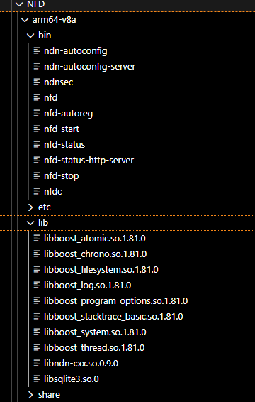
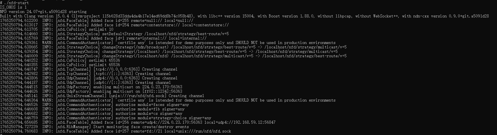

# NFD集成到应用hap
本库是在RK3568开发板上基于OpenHarmony3.2 Release版本的镜像验证的，如果是从未使用过RK3568，可以先查看[润和RK3568开发板标准系统快速上手](https://gitee.com/openharmony-sig/knowledge_demo_temp/tree/master/docs/rk3568_helloworld)。
## 开发环境
- [开发环境准备](../../../docs/hap_integrate_environment.md)
## 编译三方库
- 下载本仓库
  ```
  git clone https://gitee.com/openharmony-sig/tpc_c_cplusplus.git --depth=1
  ```
  
- 三方库目录结构
  ```
  tpc_c_cplusplus/thirdparty/NFD          # 三方库NFD的目录结构如下
  ├── docs                                # 三方库相关文档的文件夹
  ├── HPKBUILD                            # 构建脚本
  ├── HPKCHECK                            # 测试脚本
  ├── SHA512SUM                           # 三方库校验文件
  ├── README.OpenSource                   # 说明三方库源码的下载地址，版本，license等信息
  ├── README_zh.md                        # 三方库说明文档
  ├── NFD_24.07_oh_pkg.patch              # 三方库适配OpenHarmony的patch文件
  ```
  
- 在lycium目录下编译三方库
  编译环境的搭建参考[准备三方库构建环境](../../../lycium/README.md#1编译环境准备)
  ```
  cd lycium
  ./build.sh NFD
  ```
  
- 三方库头文件及生成的库
  在lycium目录下会生成usr目录，该目录下存在已编译完成的32位和64位三方库
  
  ```
  NFD/arm64-v8a   NFD/armeabi-v7a
  ```
  
- [测试三方库](#测试三方库)

## 使用三方库验证
将编译产物发送到测试样机(编译环境目录最好与测试样机目录一致)

 &nbsp;

设置环境变量:

```
cd lycium/usr/NFD/arm64-v8a/bin
export __OHOS__=1
export LD_LIBRARY_PATH=$LD_LIBRARY_PATH:/data/tpc_c_cplusplus/lycium/usr/boost/arm64-v8a/lib
export LD_LIBRARY_PATH=$LD_LIBRARY_PATH:/data/tpc_c_cplusplus/lycium/usr/sqlite/arm64-v8a/lib
export LD_LIBRARY_PATH=$LD_LIBRARY_PATH:/data/tpc_c_cplusplus/lycium/usr/ndn-cxx/arm64-v8a/lib
export LD_LIBRARY_PATH=$LD_LIBRARY_PATH:/data/tpc_c_cplusplus/lycium/usr/libpcap/arm64-v8a/lib
export PATH=$PATH:/data/tpc_c_cplusplus/lycium/usr/ndn-cxx/arm64-v8a/bin/
cp ../etc/ndn/nfd.conf.sample ../etc/ndn/nfd.conf
cp ../etc/ndn/autoconfig.conf.sample ../etc/ndn/autoconfig.conf
```

在测试样机中验证以下脚本能否正常运行:

./nfd-start 启动NFD服务 ./nfd-stop 停止NFD服务，./nfd-status 查看NFD服务状态

&nbsp;

## 测试三方库
三方库的测试使用自己添加的测试用例来做测试，[准备三方库测试环境](../../../lycium/README.md#3ci环境准备)

将tpc_c_cplusplus整个目录拷贝到测试机上，进入tpc_c_cplusplus/thirdparty/NFD目录，执行以下命令：

```

cd NFD-NFD-24.07/arm64-v8a-build

export LD_LIBRARY_PATH=$LD_LIBRARY_PATH:/data/tpc_c_cplusplus/lycium/usr/boost/arm64-v8a/lib
export LD_LIBRARY_PATH=$LD_LIBRARY_PATH:/data/tpc_c_cplusplus/lycium/usr/sqlite/arm64-v8a/lib
export LD_LIBRARY_PATH=$LD_LIBRARY_PATH:/data/tpc_c_cplusplus/lycium/usr/ndn-cxx/arm64-v8a/lib
export LD_LIBRARY_PATH=$LD_LIBRARY_PATH:/data/tpc_c_cplusplus/lycium/usr/libpcap/arm64-v8a/lib

./unit-tests-core
./unit-tests-tools
./cs-benchmark
./pit-fib-benchmark
./unit-tests-daemon -t !Face/TestUnixStreamChannel -t !Mgmt/TestGeneralConfigSection
./unit-tests-daemon -t Mgmt/TestGeneralConfigSection
```

## 参考资料
- [润和RK3568开发板标准系统快速上手](https://gitee.com/openharmony-sig/knowledge_demo_temp/tree/master/docs/rk3568_helloworld)
- [OpenHarmony三方库地址](https://gitee.com/openharmony-tpc)
- [OpenHarmony知识体系](https://gitee.com/openharmony-sig/knowledge)
- [通过DevEco Studio开发一个NAPI工程](https://gitee.com/openharmony-sig/knowledge_demo_temp/blob/master/docs/napi_study/docs/hello_napi.md)
