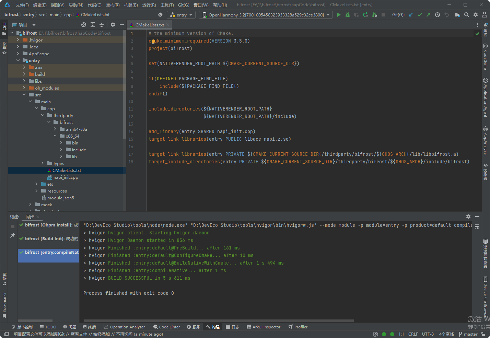
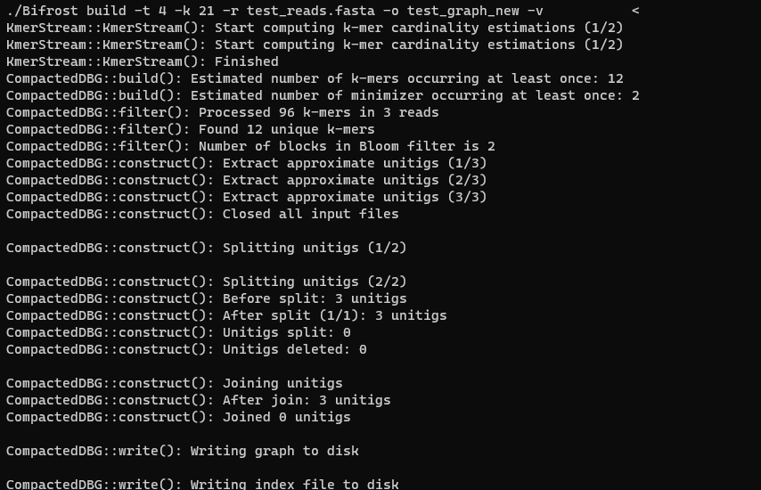
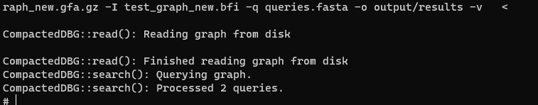

# bifrost集成到应用hap

本库是在RK3568开发板上基于OpenHarmony3.2 Release版本的镜像验证的，如果是从未使用过RK3568，可以先查看[润和RK3568开发板标准系统快速上手](https://gitee.com/openharmony-sig/knowledge_demo_temp/tree/master/docs/rk3568_helloworld)。

## 开发环境

- [开发环境准备](../../../docs/hap_integrate_environment.md)

## 编译三方库

- 下载本仓库
  ```
  git clone https://gitee.com/openharmony-sig/tpc_c_cplusplus.git --depth=1
  ```
- 三方库目录结构
  ```
  tpc_c_cplusplus/thirdparty/bifrost        #三方库bifrost的目录结构如下
  ├── docs                                  #三方库相关文档的文件夹
  ├── HPKBUILD                              #构建脚本
  ├── SHA512SUM                             #三方库校验文件
  ├── README.OpenSource                     #说明三方库源码的下载地址，版本，license等信息
  ├── README_zh.md   
  ```
- 在lycium目录下编译三方库
  编译环境的搭建参考[准备三方库构建环境](../../../lycium/README.md#1编译环境准备)
  ```
  cd lycium
  ./build.sh bifrost
  ```
- 三方库头文件及生成的库
  在lycium目录下会生成usr目录，该目录下存在已编译完成的64位，及x86\_64三方库库文件
- armeabi-v7a：不支持。此库源码大量使用 `__uint128_t` 类型，armeabi-v7a是32位位架构，无法支持`__uint128_t`，此库不支持armeabi-v7a，
  并无计支持armeabi-v7a的计划。
  ```
  bifrost/arm64-v8a   bifrost/x86_64
  ```
- [测试三方库](#测试三方库)

## 应用中使用三方库

- 拷贝库到`\\entry\libs\${OHOS_ARCH}\`目录：
  库需要在`\\entry\libs\${OHOS_ARCH}\`目录，才能集成到hap包中，所以需要将对应的库文件拷贝到对应CPU架构的目录
- 在IDE的cpp目录下新增thirdparty目录，将编译生成的库拷贝到该目录下，如下图所示

&nbsp;

- 在最外层（cpp目录下）CMakeLists.txt中添加如下语句
  ```

  target_link_libraries(entry PRIVATE ${CMAKE_CURRENT_SOURCE_DIR}/thirdparty/bifrost/${OHOS_ARCH}/lib/libbifrost.a)
  target_include_directories(entry PRIVATE ${CMAKE_CURRENT_SOURCE_DIR}/thirdparty/bifrost/${OHOS_ARCH}/include/bifrost)

  ```

## 测试三方库

bifrost三方库的测试使用原库编译出的可执行程序来做测试，进入到构建目录（arm64-v8a-build为构建64位的目录，x86\_64-build为构建x86\_64位的目录）的src目录下，执行可执行程序。需创建两个简单的测试文件，一个测试序列文件，一个查询文件。测试序列文件为test\_reads.fasta，查询文件为queries.fasta。

创建测试序列文件test\_reads.fasta：

```
cat > test_reads.fasta << 'EOF'
>read1
ATCGATCGATCGATCGATCGATCGATCGATCGATCGATCGATCGATCGATCG
>read2
GCTAGCTAGCTAGCTAGCTAGCTAGCTAGCTAGCTAGCTAGCTAGCTAGCTA
>read3
AAAACCCCGGGGTTTTAAAACCCCGGGGTTTTAAAACCCCGGGGTTTTAAAA
EOF
```

创建查询文件queries.fasta：

```
cat > queries.fasta << 'EOF'
>query1
ATCGATCGATCGATCGATCGATCG
>query2
GCTAGCTAGCTAGCTAGCTAGCTA
EOF
```

执行可执行程序构建图：

注：-t 4 表示使用4个线程构建图，-k 21 表示kmer长度为21，-r 表示输入的序列文件为test_reads.fasta，-o 表示输出的图谱文件为test_graph_new，-v 表示开启详细模式。会生成test_graph_new.gfa.gz和test_graph_new.bfi两个文件。test_graph_new.gfa.gz为压缩后的图谱文件，test_graph_new.bfi为图谱索引文件。

```
./Bifrost build -t 4 -k 21 -r test_reads.fasta -o test_graph_new -v
```
创建目录output：

```
mkdir output
```

执行可执行程序查询图：

注：-g 表示输入的图谱文件为test_graph_new.gfa.gz，-I 表示输入的图谱索引文件为test_graph_new.bfi，-q 表示输入的查询文件为queries.fasta，-o 表示输出的查询结果到output目录，-v 表示开启详细模式。

```
./Bifrost query -g test_graph_new.gfa.gz -I test_graph_new.bfi -q queries.fasta -o output -v
```
&nbsp;
&nbsp;

## 参考资料

- [润和RK3568开发板标准系统快速上手](https://gitee.com/openharmony-sig/knowledge_demo_temp/tree/master/docs/rk3568_helloworld)
- [OpenHarmony三方库地址](https://gitee.com/openharmony-tpc)
- [OpenHarmony知识体系](https://gitee.com/openharmony-sig/knowledge)
- [通过DevEco Studio开发一个NAPI工程](https://gitee.com/openharmony-sig/knowledge_demo_temp/blob/master/docs/napi_study/docs/hello_napi.md)

