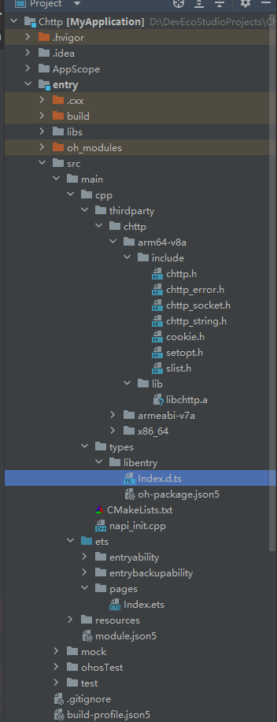
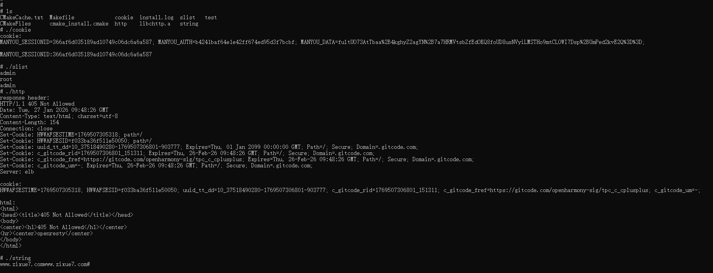

# chttp 集成到应用hap

## 开发环境

- [开发环境准备](../../../docs/hap_integrate_environment.md)

## 编译三方库

- 下载本仓库

  ```shell
  git clone https://github.com/noxue/chttp.git --depth=1
  ```

- 三方库目录结构

  ```shell
  tpc_c_cplusplus/thirdparty/chttp      #三方库chttp的目录结构如下
  ├── docs                              #三方库相关文档的文件夹
  ├── HPKBUILD                          #构建脚本
  ├── HPKCHECK                          #测试脚本
  ├── SHA512SUM                         #三方库校验文件 
  ├── README.OpenSource                 #说明三方库源码的下载地址，版本，license等信息
  ├── README_zh.md                      #三方库简介
  ```
  
- 在lycium目录下编译三方库

  编译环境的搭建参考[准备三方库构建环境](../../../lycium/README.md#1编译环境准备)

  ```shell
  cd lycium
  ./build.sh chttp
  ```

- 三方库头文件及生成的库

  在lycium目录下会生成usr目录，该目录下存在已编译完成的x86_64位、32位和64位三方库

  ```shell
  chttp/arm64-v8a   chttp/x86_64  chttp/armeabi-v7a
  ```

- [测试三方库](#测试三方库)

## 应用中使用三方库

- 在IDE的cpp目录新建一个thirdparty目录，将生成的二进制文件以及头文件拷贝到该目录下，每种架构目录下包含了该库的头文件(include)、二进制文件(lib)，如下图所示：
  &nbsp;

  &nbsp;

- 在最外层（cpp目录下）CMakeLists.txt中添加如下语句

  ```shell
  #将三方库加入工程中
  target_link_libraries(entry PRIVATE ${CMAKE_CURRENT_SOURCE_DIR}/thirdparty/chttp/${OHOS_ARCH}/lib/chttp.a)
  #将三方库的头文件加入工程中
  target_include_directories(entry PRIVATE ${CMAKE_CURRENT_SOURCE_DIR}/thirdparty/chttp/${OHOS_ARCH}/include)
  ```

## 测试三方库

三方库的测试使用原库自带的测试用例来做测试

进入到构建目录执行（arm64-v8a-build为构建64位的目录，x86_64-build为构建x86_64位的目录，armeabi-v7a-build为构建32位的目录）
```shell
  ./http;./cookie;./slist;./string                      #执行测试用例
```
&nbsp;

## 参考资料

- [润和RK3568开发板标准系统快速上手](https://gitee.com/openharmony-sig/knowledge_demo_temp/tree/master/docs/rk3568_helloworld)
- [OpenHarmony三方库地址](https://gitee.com/openharmony-tpc)
- [OpenHarmony知识体系](https://gitee.com/openharmony-sig/knowledge)
- [通过DevEco Studio开发一个NAPI工程](https://gitee.com/openharmony-sig/knowledge_demo_temp/blob/master/docs/napi_study/docs/hello_napi.md)