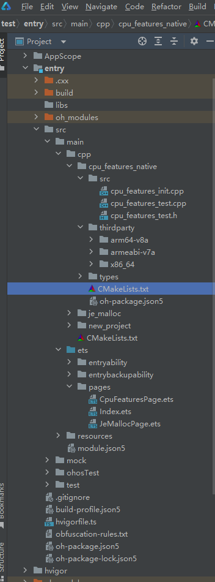
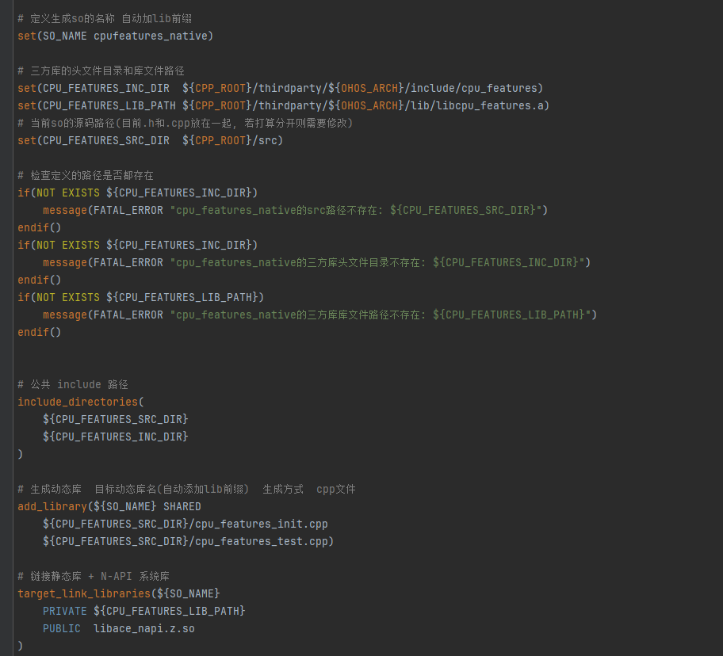

# cpu_features集成到应用hap

本库是在RK3568开发板上基于OpenHarmony3.2 Release版本的镜像验证的，如果是从未使用过RK3568，可以先查看[润和RK3568开发板标准系统快速上手](https://gitee.com/openharmony-sig/knowledge_demo_temp/tree/master/docs/rk3568_helloworld)。

## 开发环境

- [开发环境准备](../../../docs/hap_integrate_environment.md)

## 编译三方库

*   下载本仓库

    ```shell
    git clone https://gitee.com/openharmony-sig/tpc_c_cplusplus.git --depth=1
    ```

*   三方库目录结构

    ```shell
    tpc_c_cplusplus/thirdparty/cpu_features   #三方库cppjieba的目录结构如下
    ├── docs                                  #三方库相关文档的文件夹
    ├── HPKBUILD                              #构建脚本
    ├── HPKCHECK                              #测试脚本
    ├── OAT.xml                               #扫描结果文件
    ├── SHA512SUM                             #三方库校验文件
    ├── README.OpenSource                     #说明三方库源码的下载地址，版本，license等信息
    ├── README_zh.md                          #三方库简介
    ```
    
*   在lycium目录下编译三方库

    编译环境的搭建参考[准备三方库构建环境](../../../lycium/README.md#1编译环境准备)

    ```shell
    cd lycium
    ./build.sh cpu_features
    ```

*   三方库头文件及生成的库

    在lycium目录下会生成usr目录，该目录下存在已编译完成cppjieb的头文件

    ```shell
    cpu_features/arm64-v8a   cpu_features/armeabi-v7a
    ```

*   [测试三方库](#测试三方库)

## 应用中使用三方库

- 在IDE的cpp目录下新增thirdparty目录，将编译生成的头文件拷贝到该目录下；

&nbsp;

- 在最外层（cpp目录下）CMakeLists.txt中添加如下语句

  ```cmake
  #将三方库的头文件加入工程中
  # 三方库的头文件目录和库文件路径
    set(CPU_FEATURES_INC_DIR  ${CPP_ROOT}/thirdparty/${OHOS_ARCH}/include/cpu_features)
    set(CPU_FEATURES_LIB_PATH ${CPP_ROOT}/thirdparty/${OHOS_ARCH}/lib/libcpu_features.a)
    # 当前so的源码路径(目前.h和.cpp放在一起, 若打算分开则需要修改)
    set(CPU_FEATURES_SRC_DIR  ${CPP_ROOT}/src)


&nbsp;


## 测试三方库

- 编译出可执行的文件进行测试，[准备三方库测试环境](../../../lycium/README.md#3ci环境准备)

```shell
  cp -r /data/tpc_c_cplusplus/thirdparty/cppjieba/cppjieba/dict /data/tpc_c_cplusplus/thirdparty/cpu_features/cpu_features/$ARCH-build/test/
```

- 进入到构建目录运行单元测试用例（注意arm64-v8a为构建64位的目录，armeabi-v7a为构建32位的目录），执行结果如图所示

```shell
  cd /data/tpc_c_cplusplus/thirdparty/cpu_features/cpu_features/$ARCH-build/test
  ./bit_utils_test
  ./cpuinfo_arm_test
  ./stack_line_reader_test
  ./string_view_test
```
&nbsp;

&nbsp;

## 参考资料

*   [OpenHarmony三方库地址](https://gitee.com/openharmony-tpc)
*   [OpenHarmony知识体系](https://gitee.com/openharmony-sig/knowledge)

