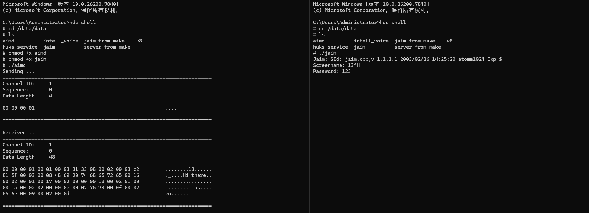
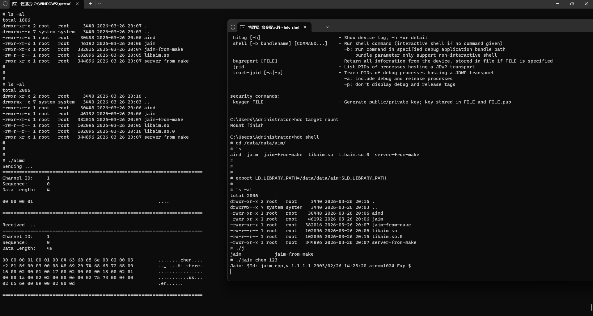

# libaim集成测试

本库是在RK3568开发板上基于OpenHarmony3.2 Release版本的镜像验证的，如果是从未使用过RK3568，可以先查看[润和RK3568开发板标准系统快速上手](https://gitee.com/openharmony-sig/knowledge_demo_temp/tree/master/docs/rk3568_helloworld)。

## 开发环境
- [开发环境准备](../../../docs/hap_integrate_environment.md)

## 编译三方库

- 下载本仓库

  ```shell
  git clone https://gitee.com/openharmony-sig/tpc_c_cplusplus.git --depth=1
  ```

- 三方库目录结构

  ```shell
  tpc_c_cplusplus/thirdparty/libaim     #三方库libaim的目录结构如下
  ├── docs                              #三方库相关文档的文件夹
  ├── HPKBUILD                          #构建脚本
  ├── HPKCHECK                          #测试脚本
  ├── README.OpenSource                 #说明三方库源码的下载地址，版本，license等信息
  ├── README_zh.md   
  ```

- 在lycium目录下编译三方库

  编译环境的搭建参考[准备三方库构建环境](../../../lycium/README.md#1编译环境准备)

  ```shell
  cd lycium
  ./build.sh libaim
  ```

- 三方库头文件及生成的库

  在lycium目录下会生成usr目录

  ```shell
  usr
  ├── hpk_build.csv
  └── libaim
      ├── arm64-v8a
      │   ├── bin
      │   │   ├── aimd				# autoconf编译
      │   │   ├── jaim				# autoconf编译
      │   │   ├── jaim-from-make		# make直接编译，未生成so文件。为编码的autoconf编译产生的jaim重名，编译结果重命名位jaim-from-make
      │   │   └── server-from-make	# make直接编译，未生成so文件。编译结果重命名位server-from-make
      │   ├── include
      │   │   └── libaim
      │   └── lib
      │       ├── libaim.a
      │       ├── libaim.la
      │       ├── libaim.so -> libaim.so.0.0.0
      │       ├── libaim.so.0 -> libaim.so.0.0.0
      │       └── libaim.so.0.0.0
      ├── armeabi-v7a
      │   ├── bin
      │   │   ├── aimd
      │   │   ├── jaim
      │   │   ├── jaim-from-make
      │   │   └── server-from-make
      │   ├── include
      │   │   └── libaim
      │   └── lib
      │       ├── libaim.a
      │       ├── libaim.la
      │       ├── libaim.so -> libaim.so.0.0.0
      │       ├── libaim.so.0 -> libaim.so.0.0.0
      │       └── libaim.so.0.0.0
      └── x86_64
          ├── bin
          │   ├── aimd
          │   ├── jaim
          │   ├── jaim-from-make
          │   └── server-from-make
          ├── include
          │   └── libaim
          └── lib
              ├── libaim.a
              ├── libaim.la
              ├── libaim.so -> libaim.so.0.0.0
              ├── libaim.so.0 -> libaim.so.0.0.0
              └── libaim.so.0.0.0
  ```
  
- [测试三方库](#测试三方库)

## 测试三方库

- 测试程序

  三方库自带测试用例，提供两对客户端和服务端测试程序

  1. 服务端aimd和客户端jaim
  2. 服务端server-from-make和客户端jaim-from-make

- 测试步骤和结果

  1. rk3568测试

     ```shell
     # 推送测试程序
     hdc.exe file send ./usr/libaim/armeabi-v7a/lib/libaim.so /system/lib/
     hdc.exe file send ./usr/libaim/armeabi-v7a/lib/libaim.so.0 /system/lib/
     hdc.exe file send ./usr/libaim/armeabi-v7a/lib/libaim.so.0.0.0 /system/lib/
     hdc.exe file send ./usr/libaim/armeabi-v7a/bin/aimd /data/data
     hdc.exe file send ./usr/libaim/armeabi-v7a/bin/jaim /data/data
     ```

     

  2. 64位手机测试
  
     ```shell
     # 推送测试程序
     hdc.exe file send ./usr/libaim/arm64-v8a/lib/libaim.so /system/lib64/
     hdc.exe file send ./usr/libaim/arm64-v8a/lib/libaim.so.0 /system/lib64/
     hdc.exe file send ./usr/libaim/arm64-v8a/lib/libaim.so.0.0.0 /system/lib64/
     hdc.exe file send ./usr/libaim/arm64-v8a/bin/aimd /data/data
     hdc.exe file send ./usr/libaim/arm64-v8a/bin/jaim /data/data
     ```
  
     

说明：

当前测试程序使用本机IP（127.0.0.1）和端口（5190）。当重复测试时，可能因端口被占用造成进程挂死问题。在测试前，需清理相关资源。


## 参考资料

- [润和RK3568开发板标准系统快速上手](https://gitee.com/openharmony-sig/knowledge_demo_temp/tree/master/docs/rk3568_helloworld)
- [OpenHarmony三方库地址](https://gitee.com/openharmony-tpc)
- [OpenHarmony知识体系](https://gitee.com/openharmony-sig/knowledge)
- [通过DevEco Studio开发一个NAPI工程](https://gitee.com/openharmony-sig/knowledge_demo_temp/blob/master/docs/napi_study/docs/hello_napi.md)
