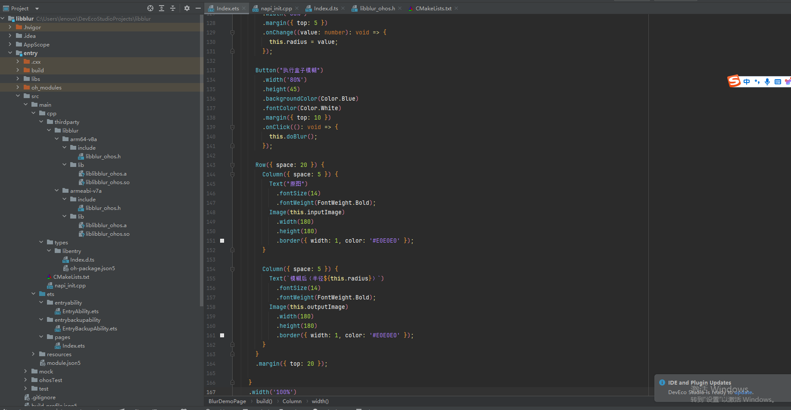
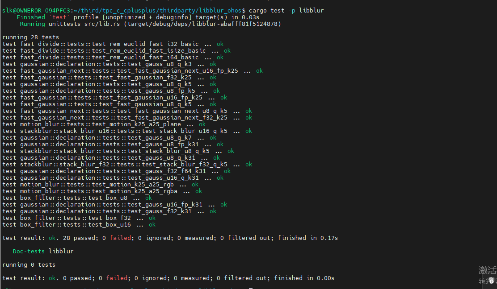
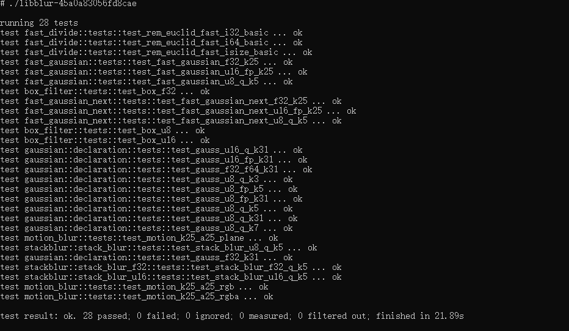

# libblur集成到应用hap
本库是在RK3568开发板上基于OpenHarmony3.2 Release版本的镜像验证的，如果是从未使用过RK3568，可以先查看[润和RK3568开发板标准系统快速上手](https://gitee.com/openharmony-sig/knowledge_demo_temp/tree/master/docs/rk3568_helloworld)。
## 开发环境

- [开发环境准备](../../../docs/hap_integrate_environment.md)

## 编译三方库
- 下载本仓库
  ```
  git clone https://gitee.com/openharmony-sig/tpc_c_cplusplus.git --depth=1
  ```

- 三方库目录结构

  ```
      tpc_c_cplusplus/thirdparty/libblur                      # 三方库的目录结构如下
      ├── docs                                                # 三方库相关文档的文件夹
      ├── HPKBUILD                                            # 构建脚本
      ├── HPKCHECK                                            # 测试脚本
      ├── README.OpenSource                                   # 说明三方库源码的下载地址，版本，license等信息
      ├── README_zh.md                                        # 三方库简介
    ```

 - 在lycium目录下编译三方库，编译环境的搭建参考[准备三方库构建环境](../../../lycium/README.md#1编译环境准备)
 	   
 	   ```shell
 	   cd lycium
 	   ./build.sh libblur
 	   ```

 - 三方库头文件及生成的库，在lycium目录下会生成usr目录，该目录下存在已编译完成的32位和64位三方库

  ```
  libblur/arm64-v8a    libblur/armeabi-v7a
  ```

- 三方库生成的测试用例
  生成的测试用例在libblur_ohos/target/（$ARCH）aarch64-unknown-linux-ohos/debug/deps/libblur-fe9bed55346080c8

- [测试三方库](#测试三方库)

## 应用中使用三方库

- 在IDE的cpp目录下新增thirdparty目录，将编译生成的库以及依赖库拷贝到该目录下，如下图所示
  
&nbsp;

- 在最外层（cpp目录下）CMakeLists.txt中添加如下语句
  ```
  #将三方库加入工程中
  target_link_libraries(entry PRIVATE ${CMAKE_CURRENT_SOURCE_DIR}/thirdparty/libblur/${OHOS_ARCH}/lib/libblur.so)

  #将三方库的头文件加入工程中
  target_include_directories(entry PRIVATE ${CMAKE_CURRENT_SOURCE_DIR}/thirdparty/libblur/${OHOS_ARCH}/include)
  ```

&nbsp;

## 测试三方库
三方库的测试使用原库自带的测试用例来做测试

- 将编译生成的可执行文件及生成的动态库准备好

- cd /data/tpc_c_cplusplus/thirdparty/libblur_ohos/target/aarch64-unknown-linux-ohos/debug/deps
  ./libblur-45a0a83056fd8cae(测试用例名称为libblur-后面加随机数，无后缀)

&nbsp;

## 参考资料
- [润和RK3568开发板标准系统快速上手](https://gitee.com/openharmony-sig/knowledge_demo_temp/tree/master/docs/rk3568_helloworld)
- [OpenHarmony三方库地址](https://gitee.com/openharmony-tpc)
- [OpenHarmony知识体系](https://gitee.com/openharmony-sig/knowledge)
- [通过DevEco Studio开发一个NAPI工程](https://gitee.com/openharmony-sig/knowledge_demo_temp/blob/master/docs/napi_study/docs/hello_napi.md)
