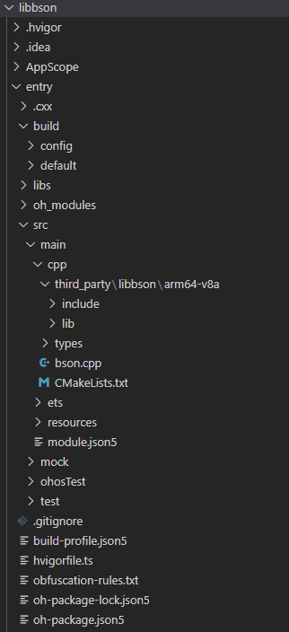

# libbson集成到应用hap
本库是在RK3568开发板上基于OpenHarmony4.0 Release版本的镜像验证的，如果是从未使用过RK3568，可以先查看[润和RK3568开发板标准系统快速上手](https://gitee.com/openharmony-sig/knowledge_demo_temp/tree/master/docs/rk3568_helloworld)。
## 开发环境

- [开发环境准备](../../../docs/hap_integrate_environment.md)

## 编译三方库
- 下载本仓库
  ```
  git clone https://gitee.com/openharmony-sig/tpc_c_cplusplus.git --depth=1
  ```
  
- 三方库目录结构
    ```shell
    tpc_c_cplusplus/thirdparty/libbson    #三方库libbson的目录结构如下
    ├── docs                              #三方库相关文档的文件夹
    ├── HPKBUILD                          #构建脚本
    ├── HPKCHECK                          #测试脚本
    ├── libbson_ohos_pkg.patch            #三方库libbson的patch文件
    ├── OAT.xml                           #扫描结果文件
    ├── SHA512SUM                         #三方库校验文件
    ├── README.OpenSource                 #说明三方库源码的下载地址，版本，license等信息
    ├── README_zh.md                      #三方库简介
    ```
  
- 编译三方库
  编译环境的搭建参考[准备三方库构建环境](../../../lycium/README.md#1编译环境准备)
  
  ```
  ./lycium/build.sh libbson
  ```
  
- 三方库头文件及生成的库
  在lycium目录下会生成usr目录，该目录下存在已编译完成的arm64-v8a、armeabi-v7a、x86_64架构的三方库
  
  ```
  libbson/arm64-v8a   libbson/armeabi-v7a   libbson/x86_64
  ```
  
- [测试三方库](#测试三方库)

## 应用中使用三方库
- 拷贝动态库到`\\entry\libs\${OHOS_ARCH}\`目录：
  动态库需要在`\\entry\libs\${OHOS_ARCH}\`目录，才能集成到hap包中，所以需要将对应的so文件拷贝到对应CPU架构的目录
  
- 在IDE的cpp目录下新增thirdparty目录，将编译生成的库拷贝到该目录下，如下图所示

  &nbsp;

- 在最外层（cpp目录下）CMakeLists.txt中添加如下语句
  ```
  
  #将三方库加入工程中
  target_link_libraries(entry PRIVATE ${CMAKE_CURRENT_SOURCE_DIR}/thirdparty/libbson/${OHOS_ARCH}/lib/libbson2.so.2)
  #将三方库的头文件加入工程中
  target_include_directories(entry PRIVATE ${CMAKE_CURRENT_SOURCE_DIR}/thirdparty/libbson/${OHOS_ARCH}/include/bson-2.1.2)
  
  ```
## 测试三方库
三方库的测试使用原库自带的测试用例来做测试，[准备三方库测试环境](../../../lycium/README.md#3ci环境准备)

在源码根目录下执行测试（arm64-v8a-build为构建64位的目录，armeabi-v7a-build为构建32位的目录）
```
# 测试命令为./构建目录/src/libmongoc/test-libmongoc -l '/bson/*'
  ./armeabi-v7a-build/src/libmongoc/test-libmongoc -l '/bson/*'
```


## 参考资料
- [润和RK3568开发板标准系统快速上手](https://gitee.com/openharmony-sig/knowledge_demo_temp/tree/master/docs/rk3568_helloworld)
- [OpenHarmony三方库地址](https://gitee.com/openharmony-tpc)
- [OpenHarmony知识体系](https://gitee.com/openharmony-sig/knowledge)
- [通过DevEco Studio开发一个NAPI工程](https://gitee.com/openharmony-sig/knowledge_demo_temp/blob/master/docs/napi_study/docs/hello_napi.md)
