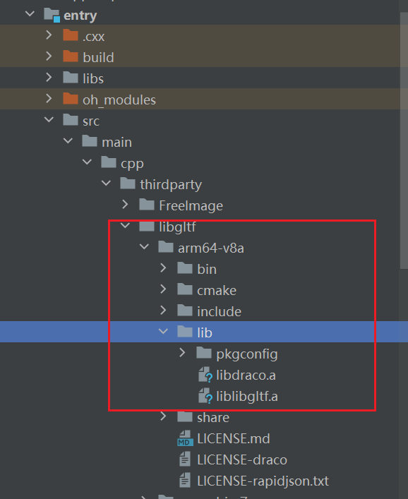
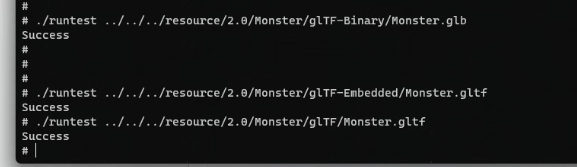

# libgltf集成到应用hap
本库是在RK3568开发板上基于OpenHarmony3.2 Release版本的镜像验证的，如果是从未使用过RK3568，可以先查看[润和RK3568开发板标准系统快速上手](https://gitee.com/openharmony-sig/knowledge_demo_temp/tree/master/docs/rk3568_helloworld)。
## 开发环境
- [开发环境准备](../../../docs/hap_integrate_environment.md)
## 编译三方库
- 下载本仓库
  ```
  git clone https://gitee.com/openharmony-sig/tpc_c_cplusplus.git --depth=1
  ```
  
- 三方库目录结构
  ```
  tpc_c_cplusplus/thirdparty/libgltf                      #三方库libgltf的目录结构如下
  ├── docs                                                #三方库相关文档的文件夹
  ├── HPKBUILD                                            #构建脚本
  ├── HPKCHECK                                            #测试脚本
  ├── SHA512SUM                                           #三方库校验文件
  ├── libgltf_oh_pkg.patch                                #patch文件
  ├── README.OpenSource                                   #说明三方库源码的下载地址，版本，license等信息
  ├── README_zh.md   
  ```
  
- 在lycium目录下编译三方库
  编译环境的搭建参考[准备三方库构建环境](../../../lycium/README.md#1编译环境准备)
  
  ```
  cd lycium
  ./build.sh libgltf
  ```
  
- 三方库头文件及生成的库

  在lycium目录下会生成usr目录，该目录下存在已编译完成的32位和64位三方库

  ```shell
  libgltf/arm64-v8a   libgltf/armeabi-v7a
  ```
  
- [测试三方库](#测试三方库)

## 应用中使用三方库

- 在IDE的cpp目录下新增thirdparty目录，如下图所示

  

- 在最外层（cpp目录下）CMakeLists.txt中添加如下语句

  ```shell
  #将三方库头文件和库文件加入工程中
  target_link_libraries(entry PRIVATE ${CMAKE_CURRENT_SOURCE_DIR}/thirdparty/libgltf/${OHOS_ARCH}/lib/liblibgltf.a)
  target_include_directories(entry PRIVATE ${CMAKE_CURRENT_SOURCE_DIR}/thirdparty/libgltf/${OHOS_ARCH}/include/libgltf)
  #将三方库依赖库的头文件和库文件加入工程中
  target_link_libraries(entry PRIVATE ${CMAKE_CURRENT_SOURCE_DIR}/thirdparty/libgltf/${OHOS_ARCH}/lib/libdraco.a)
  target_include_directories(entry PRIVATE ${CMAKE_CURRENT_SOURCE_DIR}/thirdparty/libgltf/${OHOS_ARCH}/include/draco)
  ```
## 测试三方库
三方库的测试使用原库自带的测试用例来做测试，[准备三方库测试环境](../../../lycium/README.md#3ci环境准备)
执行以下命令运行测试用例
  ```
  #进入测试路径
  cd /data/tpc_c_cplusplus/thirdparty/libgltf/libgltf-0.1.11/arm64-v8a-build/source/runtest
  #导入库
  export LD_LIBRARY_PATH=/data/tpc_c_cplusplus/thirdparty/libgltf/libgltf-0.1.11/arm64-v8a-build:$LD_LIBRARY_PATH
  #运行测试用例
  ./runtest ../../../resource/2.0/Monster/glTF-Binary/Monster.glb
  ./runtest ../../../resource/2.0/Monster/glTF-Embedded/Monster.gltf
  ./runtest ../../../resource/2.0/Monster/glTF/Monster.gltf
  运行测试用例（arm64-v8a-build为构建64位的目录，armeabi-v7a-build为构建32位的目录）
  ```
测试结果如下

&nbsp;

## 参考资料
- [润和RK3568开发板标准系统快速上手](https://gitee.com/openharmony-sig/knowledge_demo_temp/tree/master/docs/rk3568_helloworld)
- [OpenHarmony三方库地址](https://gitee.com/openharmony-tpc)
- [OpenHarmony知识体系](https://gitee.com/openharmony-sig/knowledge)
- [通过DevEco Studio开发一个NAPI工程](https://gitee.com/openharmony-sig/knowledge_demo_temp/blob/master/docs/napi_study/docs/hello_napi.md)
