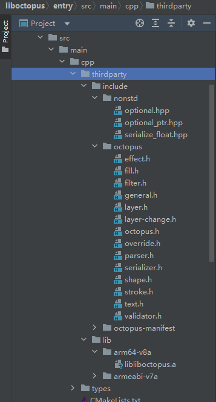
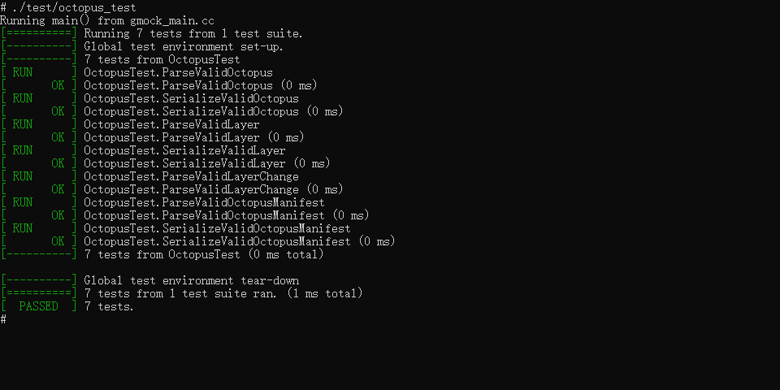

# liboctopus集成到应用hap
本库是在RK3568开发板上基于OpenHarmony3.2 Release版本的镜像验证的，如果是从未使用过RK3568，可以先查看[润和RK3568开发板标准系统快速上手](https://gitee.com/openharmony-sig/knowledge_demo_temp/tree/master/docs/rk3568_helloworld)。
## 开发环境
- [开发环境准备](../../../docs/hap_integrate_environment.md)
## 编译三方库
- 下载本仓库
  ```
  git clone https://gitee.com/openharmony-sig/tpc_c_cplusplus.git --depth=1
  ```
  
- 三方库目录结构
  ```
  tpc_c_cplusplus/thirdparty/liboctopus   # 三方库liboctopus的目录结构如下
  ├── docs                                # 三方库相关文档的文件夹
  ├── HPKBUILD                            # 构建脚本
  ├── HPKCHECK                            # 测试脚本
  ├── SHA512SUM                           # 三方库校验文件
  ├── README.OpenSource                   # 说明三方库源码的下载地址，版本，license等信息
  ├── README_zh.md                        # 三方库说明文档
  ├── octopus_3.0.2_oh_test.patch         # 三方库适配OpenHarmony的patch文件
  ```
  
- 在lycium目录下编译三方库
  编译环境的搭建参考[准备三方库构建环境](../../../lycium/README.md#1编译环境准备)
  ```
  cd lycium
  ./build.sh liboctopus
  ```
  
- 三方库头文件及生成的库
  在lycium目录下会生成usr目录，该目录下存在已编译完成的32位和64位三方库
  
  ```
  liboctopus/arm64-v8a   liboctopus/armeabi-v7a
  ```
  
- [测试三方库](#测试三方库)

## 应用中使用三方库

- 在IDE的cpp目录下新增thirdparty目录，将编译生成的头文件和库拷贝到该目录下，如下图所示

&nbsp;
- 在cpp目录下CMakeLists.txt中添加如下语句
  ```

  set(NATIVERENDER_ROOT_PATH ${CMAKE_CURRENT_SOURCE_DIR})
  set(LIBOCTOPUS_LIB_PATH ${NATIVERENDER_ROOT_PATH}/thirdparty/lib/${OHOS_ARCH}/libliboctopus.a)


  #将三方库加入工程中
  target_link_libraries(entry
    PUBLIC ${LIBOCTOPUS_LIB_PATH} libace_napi.z.so
  )

  #将三方库的头文件加入工程中
  include_directories(${NATIVERENDER_ROOT_PATH}
                    ${NATIVERENDER_ROOT_PATH}/thirdparty/include)
  ```
## 测试三方库
三方库的测试使用自己添加的测试用例来做测试，[准备三方库测试环境](../../../lycium/README.md#3ci环境准备)

进入到构建目录执行./test/octopus_test 运行测试用例（arm64-v8a-build为构建64位的目录，armeabi-v7a-build为构建32位的目录）

&nbsp;

## 参考资料
- [润和RK3568开发板标准系统快速上手](https://gitee.com/openharmony-sig/knowledge_demo_temp/tree/master/docs/rk3568_helloworld)
- [OpenHarmony三方库地址](https://gitee.com/openharmony-tpc)
- [OpenHarmony知识体系](https://gitee.com/openharmony-sig/knowledge)
- [通过DevEco Studio开发一个NAPI工程](https://gitee.com/openharmony-sig/knowledge_demo_temp/blob/master/docs/napi_study/docs/hello_napi.md)
