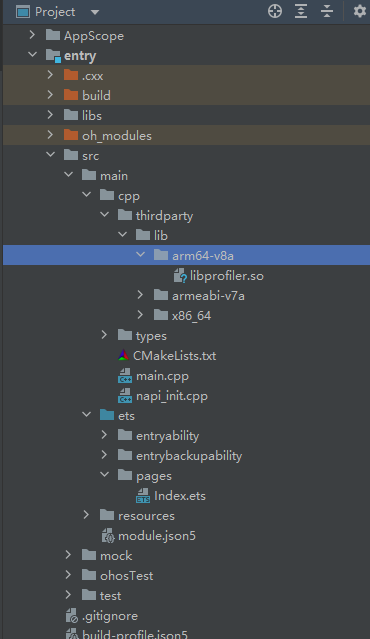
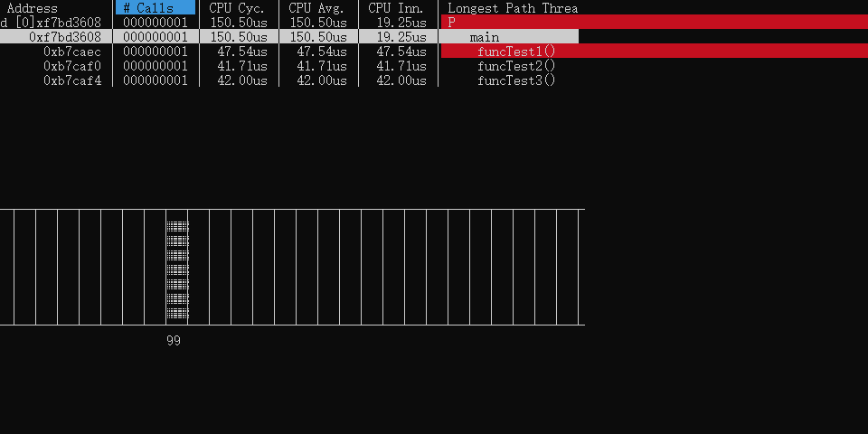

# libprofiler集成到应用hap
本库是在RK3568开发板上基于OpenHarmony3.2 Release版本的镜像验证的，如果是从未使用过RK3568，可以先查看[润和RK3568开发板标准系统快速上手](https://gitee.com/openharmony-sig/knowledge_demo_temp/tree/master/docs/rk3568_helloworld)。
## 开发环境
- [开发环境准备](../../../docs/hap_integrate_environment.md)
## 编译三方库
- 下载本仓库
  ```
  git clone https://gitee.com/openharmony-sig/tpc_c_cplusplus.git --depth=1
  ```
  
- 三方库目录结构
  ```
  tpc_c_cplusplus/thirdparty/libprofiler  # 三方库libprofiler的目录结构如下
  ├── docs                                # 三方库相关文档的文件夹
  ├── HPKBUILD                            # 构建脚本
  ├── README.OpenSource                   # 说明三方库源码的下载地址，版本，license等信息
  ├── README_zh.md                        # 三方库说明文档
  ├── libprofiler_oh_pkg.patch            # 三方库适配OpenHarmony的patch文件
  ```
  
- 在lycium目录下编译三方库
  编译环境的搭建参考[准备三方库构建环境](../../../lycium/README.md#1编译环境准备)
  ```
  cd lycium
  ./build.sh libprofiler
  ```
  
- 三方库头文件及生成的库
  在lycium目录下会生成usr目录，该目录下存在已编译完成的32位和64位三方库
  
  ```
  libprofiler/arm64-v8a   libprofiler/armeabi-v7a
  ```
  
- [测试三方库](#测试三方库)

## 应用中使用三方库

- 在IDE的cpp目录下新增thirdparty目录，将编译生成的库拷贝到该目录下，如下图所示

&nbsp;
- 在cpp目录下CMakeLists.txt中添加如下语句
  ```
  set(LIBPROFILER_PATH ${NATIVERENDER_ROOT_PATH}/thirdparty/lib/${OHOS_ARCH}/libprofiler.so)
  
  add_compile_options(-g)
  set(CMAKE_EXE_LINKER_FLAGS "${CMAKE_EXE_LINKER_FLAGS} -rdynamic")
  add_compile_options(-finstrument-functions)

  add_executable(entry
      ${NATIVERENDER_ROOT_PATH}/main.cpp
  )

  include_directories(${NATIVERENDER_ROOT_PATH}
                      ${NATIVERENDER_ROOT_PATH}/thirdparty/include)

  target_link_libraries(entry PUBLIC libace_napi.z.so ${LIBPROFILER_PATH})
  ```

  将libprofiler.so 和 编译产物entry推送到测试机上。

  将ncurses的编译产物 lycium/usr/ncurses/arm64-v8a/share/terminfo 推送到测试机上。

  设置环境变量：

  ```
  export LD_LIBRARY_PATH=$LD_LIBRARY_PATH:.
  export TERMINFO=terminfo
  export TERM=xterm-256color
  ```

  运行程序：

  ./entry

  运行示例：

  &nbsp;

## 测试三方库
 三方库的测试使用原库自带的测试用例来做测试，[准备三方库测试环境](../../../lycium/README.md#3ci环境准备)

 进入到构建目录运行测试用例（arm64-v8a-build为构建64位的目录，armeabi-v7a-build为构建32位的目录）
 
 ```
 cd /libprofiler/arm64-v8a-build/test
 ./profilerTest
 ```

## 参考资料
- [润和RK3568开发板标准系统快速上手](https://gitee.com/openharmony-sig/knowledge_demo_temp/tree/master/docs/rk3568_helloworld)
- [OpenHarmony三方库地址](https://gitee.com/openharmony-tpc)
- [OpenHarmony知识体系](https://gitee.com/openharmony-sig/knowledge)
- [通过DevEco Studio开发一个NAPI工程](https://gitee.com/openharmony-sig/knowledge_demo_temp/blob/master/docs/napi_study/docs/hello_napi.md)
