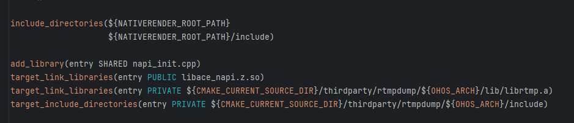
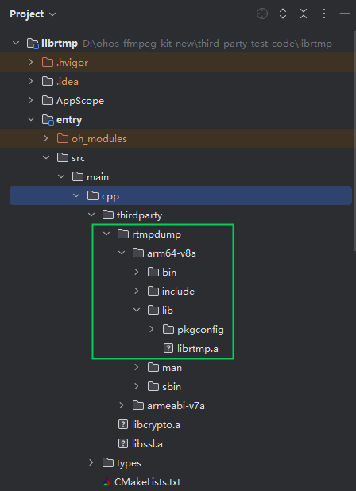
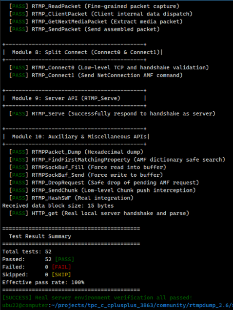

# librtmp集成到应用hap

本库是在RK3568开发板上基于OpenHarmony3.2 Release版本的镜像验证的，如果是从未使用过RK3568，可以先查看[润和RK3568开发板标准系统快速上手](https://gitee.com/openharmony-sig/knowledge_demo_temp/tree/master/docs/rk3568_helloworld)。

## 开发环境

- [开发环境准备](../../../docs/hap_integrate_environment.md)

## 编译三方库

*   下载本仓库

    ```shell
    git clone https://gitee.com/openharmony-sig/tpc_c_cplusplus.git --depth=1
    ```

*   三方库目录结构

    ```shell
    tpc_c_cplusplus/thirdparty/librtmp    #三方库librtmp的目录结构如下
    ├── docs                              #三方库相关文档的文件夹
    ├── HPKBUILD                          #构建脚本
    ├── HPKCHECK                          #测试脚本
    ├── SHA512SUM                         #三方库校验文件
    ├── README.OpenSource                 #说明三方库源码的下载地址，版本，license等信息
    ├── README_zh.md                      #三方库简介
    ```
    
*   在lycium目录下编译三方库

    编译环境的搭建参考[准备三方库构建环境](../../../lycium/README.md#1编译环境准备)

    ```shell
    cd lycium
    ./build.sh librtmp
    ```

*   三方库头文件及生成的库

    在lycium目录下会生成usr目录，该目录下存在已编译完成的32位和64位三方库

    ```shell
    librtmp/arm64-v8a   librtmp/armeabi-v7a  librtmp/
    ```

*   [测试三方库](#测试三方库)

## 应用中使用三方库

- 在IDE的cpp目录新建一个thirdparty目录，将生成的二进制文件以及头文件拷贝到该目录下，每种架构目录下包含了该库的头文件(include)、二进制文件(lib)，如下图所示：
  &nbsp;

  &nbsp;

- 在最外层（cpp目录下）CMakeLists.txt中添加如下语句

  ```shell
  #将三方库加入工程中
  target_link_libraries(entry PRIVATE ${CMAKE_CURRENT_SOURCE_DIR}/thirdparty/rtmpdump/${OHOS_ARCH}/lib/librtmp.a)
  #将三方库的头文件加入工程中
  target_include_directories(entry PRIVATE ${CMAKE_CURRENT_SOURCE_DIR}/thirdparty/rtmpdump/${OHOS_ARCH}/include)
  ```

## 测试三方库

- 编译出可执行的文件进行测试，[准备三方库测试环境](../../../lycium/README.md#3ci环境准备)

- 进入到构建目录运行单元测试用例（注意arm64-v8a为构建64位的目录，armeabi-v7a为构建32位的目录），执行结果如图所示

```shell
    1、将本地的测试库，资源文件推送到测试机Hdc file send tpc_c_cplusplus.tar.gz /data
    2、进入测试机进行解压
        hdc shell
        cd data
        tar -xvf tpc_c_cplusplus.tar.gz
    3、执行测试
        cd  tpc_c_cplusplus/thirdparty/librtmp/rtmpdump-6f6bb1353fc84f4cc37138baa99f586750028a01-arm64-v8a-build
        配置环境变量：export LD_LIBRARY_PATH=/data/tpc_c_cplusplus/lycium/usr/openssl_3.4.3/arm64-v8a/lib:$LD_LIBRARY_PATH
        再执行以下命令
        ./test_librtmp -i 115.191.52.86 -p 4070 -v
    
```

&nbsp;

## 参考资料

*   [OpenHarmony三方库地址](https://gitee.com/openharmony-tpc)
*   [OpenHarmony知识体系](https://gitee.com/openharmony-sig/knowledge)
*   [librtmp三方库地址](http://rtmpdump.mplayerhq.hu/)

