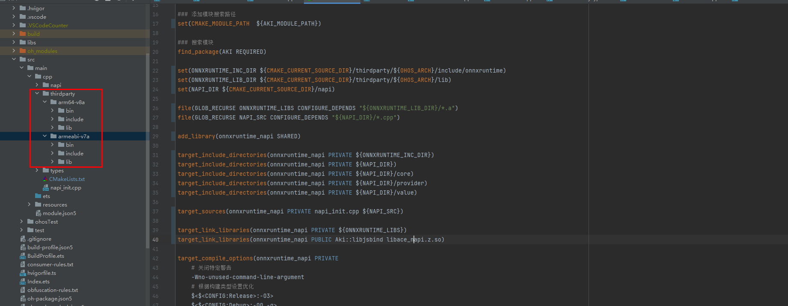
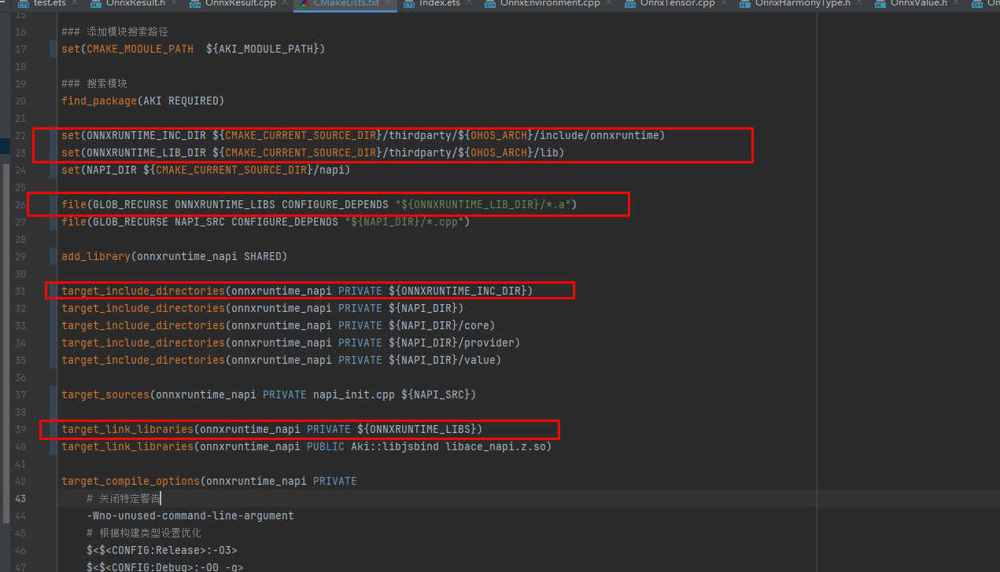
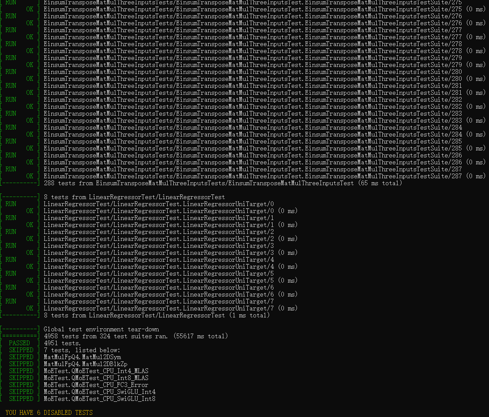

# ONNX Runtime集成到应用hap

本库是在RK3568开发板上基于OpenHarmony3.2 Release版本的镜像验证的，如果是从未使用过RK3568，可以先查看[润和RK3568开发板标准系统快速上手](https://gitee.com/openharmony-sig/knowledge_demo_temp/tree/master/docs/rk3568_helloworld)。

## 开发环境

- [开发环境准备](../../../docs/hap_integrate_environment.md)

## 编译三方库

- 下载本仓库

  ```shell
  git clone https://gitee.com/openharmony-sig/tpc_c_cplusplus.git --depth=1
  ```

- 三方库目录结构

  ```shell
  tpc_c_cplusplus/thirdparty/onnxruntime #三方库onnxruntime的目录结构如下
  ├── docs                               #三方库相关文档的文件夹
  ├── HPKBUILD                           #构建脚本
  ├── HPKCHECK                           #测试脚本
  ├── ohos-1.23.2.patch                  #PATCH 文件
  ├── README.OpenSource                  #说明三方库源码的下载地址，版本，license等信息
  ├── README_zh.md   
  ```

- 在lycium目录下编译三方库
  编译环境的搭建参考[准备三方库构建环境](../../../lycium/README.md#1编译环境准备)
  
  ```
  cd lycium
  ./build.sh onnxruntime
  ```

- 三方库头文件及生成的库
  在lycium目录下会生成usr目录，该目录下存在已编译完成的32位和64位三方库
  ```
  onnxruntime/arm64-v8a   onnxruntime/armeabi-v7a
  ```

- [测试三方库](#测试三方库)

## 应用中使用三方库

- 在IDE的cpp目录下新增thirdparty目录，将编译生成的库以及依赖库拷贝到该目录下，如下图所示
  
&nbsp;

- 在最外层（cpp目录下）CMakeLists.txt中添加如下语句
  ```
  set(ONNXRUNTIME_INC_DIR ${CMAKE_CURRENT_SOURCE_DIR}/thirdparty/${OHOS_ARCH}/include/onnxruntime)
  set(ONNXRUNTIME_LIB_DIR ${CMAKE_CURRENT_SOURCE_DIR}/thirdparty/${OHOS_ARCH}/lib)
  file(GLOB_RECURSE ONNXRUNTIME_LIBS CONFIGURE_DEPENDS "${ONNXRUNTIME_LIB_DIR}/*.a")
  #将三方库的头文件加入工程中
  target_include_directories(onnxruntime_napi PRIVATE ${ONNXRUNTIME_INC_DIR})  
  #将三方库加入工程中
  target_link_libraries(onnxruntime_napi PRIVATE ${ONNXRUNTIME_LIBS})
  ```

&nbsp;

## 测试三方库
三方库的测试使用原库自带的测试用例来做测试，[准备三方库测试环境](../../../lycium/README.md#3ci环境准备)

- 将编译生成的可执行文件及生成的动态库准备好

- 将准备好的文件推送到开发板，进入到构建的目录$ARCH-build/src/test下执行测试用例

&nbsp;

## 参考资料
- [润和RK3568开发板标准系统快速上手](https://gitee.com/openharmony-sig/knowledge_demo_temp/tree/master/docs/rk3568_helloworld)
- [OpenHarmony三方库地址](https://gitee.com/openharmony-tpc)
- [OpenHarmony知识体系](https://gitee.com/openharmony-sig/knowledge)
- [通过DevEco Studio开发一个NAPI工程](https://gitee.com/openharmony-sig/knowledge_demo_temp/blob/master/docs/napi_study/docs/hello_napi.md)
