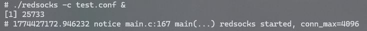

# redsocks 集成到应用hap

本库是在RK3568开发板上基于OpenHarmony3.2 Release版本的镜像验证的，如果是从未使用过RK3568，可以先查看[润和RK3568开发板标准系统快速上手](https://gitee.com/openharmony-sig/knowledge_demo_temp/tree/master/docs/rk3568_helloworld)。

## 开发环境

- [开发环境准备](../../../docs/hap_integrate_environment.md)

## 编译三方库

- 下载本仓库

  ```shell
  git clone https://gitcode.com/openharmony-sig/tpc_c_cplusplus.git --depth=1
  ```

- 三方库目录结构

  ```shell
  tpc_c_cplusplus/thirdparty/redsocks   #三方库redsocks的目录结构如下
  ├── docs                              #三方库相关文档的文件夹
  ├── HPKBUILD                          #构建脚本
  ├── HPKCHECK                          #测试脚本
  ├── SHA512SUM                         #三方库校验文件
  ├── README.OpenSource                 #说明三方库源码的下载地址，版本，license等信息
  ├── README_zh.md                      #三方库简介
  ```

- 在lycium目录下编译三方库

  编译环境的搭建参考[准备三方库构建环境](../../../lycium/README.md#1编译环境准备)

  ```shell
  cd lycium
  ./build.sh redsocks
  ```

- 三方库可执行文件

  在lycium目录下会生成usr目录，该目录下存在已编译完成的32位和64位三方库可执行文件

  ```shell
  redsocks/arm64-v8a   redsocks/armeabi-v7a   redsocks/x86_64
  ```

- [测试三方库](#测试三方库)

## 应用中使用三方库

- 直接在命令行中使用三方库：
  &nbsp;

  &nbsp;

## 测试三方库

根据HPKCHECK文件中的redsocks测试步骤，执行测试操作。

## 参考资料

- [润和RK3568开发板标准系统快速上手](https://gitee.com/openharmony-sig/knowledge_demo_temp/tree/master/docs/rk3568_helloworld)
- [OpenHarmony三方库地址](https://gitee.com/openharmony-tpc)
- [OpenHarmony知识体系](https://gitee.com/openharmony-sig/knowledge)