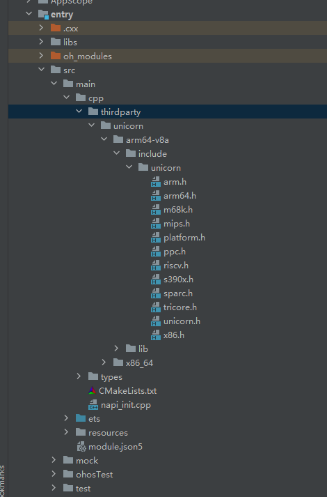
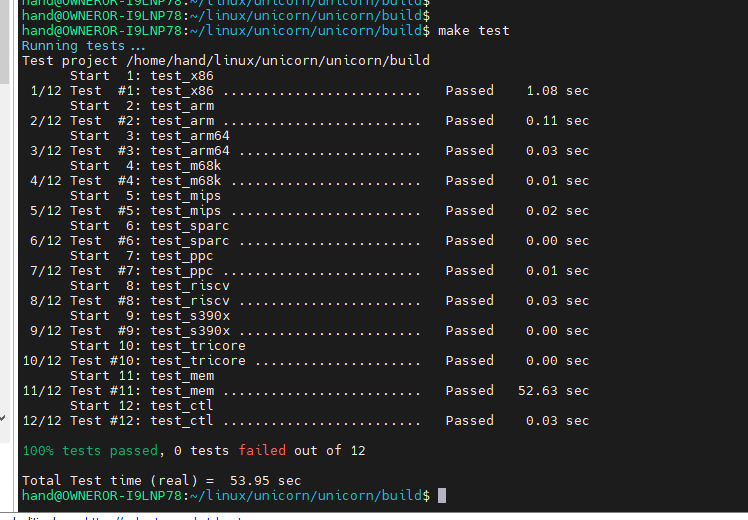

## 开发环境

- [开发环境准备](../../../docs/hap_integrate_environment.md)

## 编译三方库
- 下载本仓库
  ```
  git clone https://gitee.com/openharmony-sig/tpc_c_cplusplus.git --depth=1
  ```
  
- 三方库目录结构
  ```
  tpc_c_cplusplus/thirdparty/unicorn      #三方库unicorn的目录结构如下
  ├── docs                              #三方库相关文档的文件夹
  ├── HPKBUILD                          #构建脚本
  ├── SHA512SUM                         #三方库校验文件
  ├── README.OpenSource                 #说明三方库源码的下载地址，版本，license等信息
  ├── README_zh.md      
  ```
  
- 编译三方库
  编译环境的搭建参考[准备三方库构建环境](../../../lycium/README.md#1编译环境准备)
  
  ```
  ./lycium/build.sh unicorn
  ```
  
- 三方库头文件及生成的库
  在lycium目录下会生成usr目录，该目录下存在已编译完成的x86_64位、64位、32位的三方库
  
  ```
  unicorn/arm64-v8a   unicorn/x86_64    unicorn/armeabi-v7a
  ```
  
- [测试三方库](#测试三方库)

## 应用中使用三方库
- 在IDE的`\\entry\src\main\cpp\thirdparty\`目录下新增thirdparty目录，将编译生成的库拷贝到该目录下，如下图所示

  &nbsp;

- 在最外层（cpp目录下）CMakeLists.txt中添加如下语句
  ```
  
  #将三方库加入工程中
  target_link_libraries(entry PRIVATE ${CMAKE_CURRENT_SOURCE_DIR}/thirdparty/unicorn/${OHOS_ARCH}/lib/libunicorn.a)
  #将三方库的头文件加入工程中
  include_directories(entry PRIVATE ${CMAKE_CURRENT_SOURCE_DIR}/thirdparty/unicorn/${OHOS_ARCH}/include)
  
  ```
## 测试三方库
三方库的测试使用原库自带的测试用例来做测试，[准备三方库测试环境](../../../lycium/README.md#3ci环境准备)

进入到构建目录执行make test 运行测试用例（arm64-v8a-build为构建64位的目录，x86_64-build为构建64位的目录）


