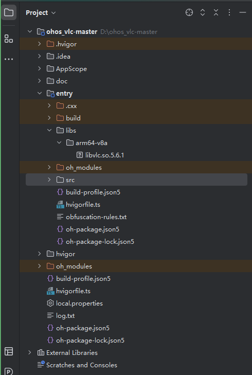

# vlc integrated into the app hap

This library is verified based on the OpenHarmony 3.2 Release version on the RK3568 development board. If you have never used RK3568 before, you can first check the [Runhe RK3568 development board standard system for quick learning](https://gitee.com/openharmony-sig/knowledge_demo_temp/tree/master/docs/rk3568_helloworld)。

## Development environment

- [Development environment preparation](../../../docs/hap_integrate_environment.md)

## Compile third-party libraries
- Download this repository
  ```
  git clone https://gitee.com/openharmony-sig/tpc_c_cplusplus.git --depth=1
  ```
- Third-party library directory structure
  ```
  tpc_c_cplusplus/thirdparty/vlc  #The directory structure of the third-party library vid.stab is as follows
  ├── docs                              #The folders of the documents related to the third-party library
  ├── HPKBUILD                          #Building script
  ├── HPKCHECK                          #Building script
  ├── OAT.xml                           #OAT file  
  ├── README.OpenSource                 #Describes the download address, version, and license of the third-party library source code
  ├── README_en.md                      #English Description
  ├── README_zh.md                      #Introduction to Chinese Description 
  ├── SHA512SUM                         #Third-party library verification file
  ```
  
- Compile the third-party library in the lycium directory
  Setting up the compilation environment[Prepare the third-party library building environment](../../../lycium/README.md#1Compilation Environment Preparation)

  ```
  cd lycium
  ./build.sh vlc
  ```
  Note: The two variables of downloadpackage and autounpack of HPKBUILD can be modified as required. The code can be modified and the latest code can be updated


- Third-party library header file and generated library
  The usr directory is generated in the lycium directory, which contains the compiled 64-bit third-party library
  ```
  vlc/arm64-v8a
  ```

## Use third-party libraries in applications

- Copies the libraries generated by compilation and the dependent libraries\ohos_vlc-master\entry\libs Below, as shown in the following figure
  


- Add the following statement to the outermost CMakeLists.txt (located in the \src\main\cpp directory).
  add_library(vlc SHARED IMPORTED)
  set_target_properties(vlc PROPERTIES
      IMPORTED_LOCATION "${CMAKE_CURRENT_SOURCE_DIR}/../../../libs/${OHOS_ARCH}/libvlc.so.5.6.1")

## Reference
- [Runhe RK3568 development board standard system quickly get started](https://gitee.com/openharmony-sig/knowledge_demo_temp/tree/master/docs/rk3568_helloworld)
- [OpenHarmony third-party library address](https://gitee.com/openharmony-tpc)
- [OpenHarmony knowledge system](https://gitee.com/openharmony-sig/knowledge)
- [Develop a NAPI project through DevEco Studio](https://gitee.com/openharmony-sig/knowledge_demo_temp/blob/master/docs/napi_study/docs/hello_napi.md)
