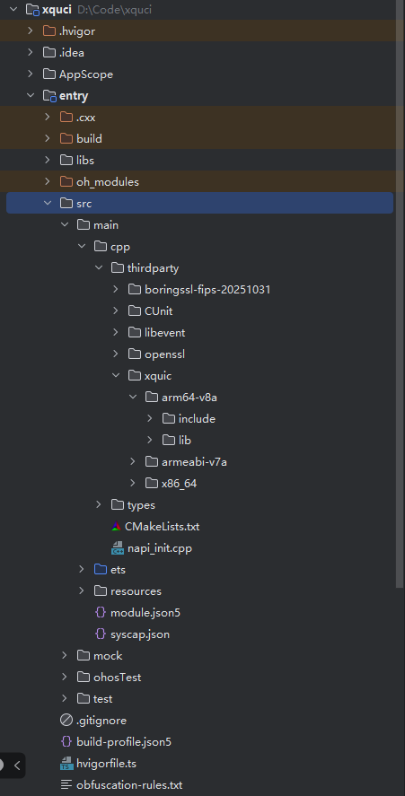
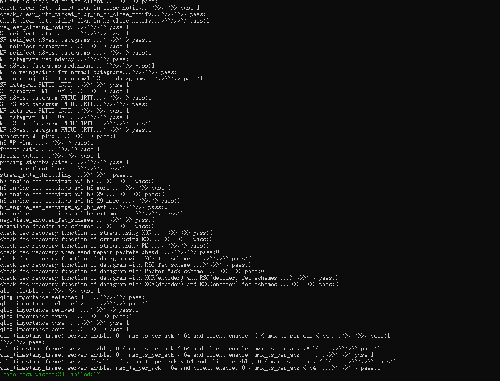

## 开发环境

- [开发环境准备](../../../docs/hap_integrate_environment.md)

## 编译三方库
- 下载本仓库
  ```
  git clone https://gitee.com/openharmony-sig/tpc_c_cplusplus.git --depth=1
  ```
  
- 三方库目录结构
  ```
  tpc_c_cplusplus/thirdparty/xquic      #三方库xquic的目录结构如下
  ├── docs                              #三方库相关文档的文件夹
  ├── HPKBUILD                          #构建脚本
  ├── HPKCHECK                          #自动化测试脚本
  ├── README_zh.md
  ├── README.OpenSource                 #说明三方库源码的下载地址，版本，license等信息
  ├── xquic.patch      
  ```
  
- 编译三方库
  编译环境的搭建参考[准备三方库构建环境](../../../lycium/README.md#1编译环境准备)
  
  ```
  ./lycium/build.sh xquic
  ```
  
- 三方库头文件及生成的库
  在lycium目录下会生成usr目录，该目录下存在已编译完成的x86_64位和arm64位 arm32位三方库
  
  ```
  xquic/arm64-v8a   xquic/armeabi-v7a xquic/x86_64
  ```
  
- [测试三方库](#测试三方库)

## 应用中使用三方库
- 拷贝动态库到`\\entry\libs\${OHOS_ARCH}\`目录：
  动态库需要在`\\entry\libs\${OHOS_ARCH}\`目录，才能集成到hap包中，所以需要将对应的so文件拷贝到对应CPU架构的目录
  
- 在IDE的cpp目录下新增thirdparty目录，将编译生成的库拷贝到该目录下，如下图所示

  &nbsp;

- 在最外层（cpp目录下）CMakeLists.txt中添加如下语句
  ```
  #将三方库的头文件加入工程中
  target_include_directories(entry PRIVATE
    ${NATIVERENDER_ROOT_PATH}/thirdparty/xquic/${OHOS_ARCH}/include
    ${NATIVERENDER_ROOT_PATH}/thirdparty/boringssl-fips-20251031/${OHOS_ARCH}/include
    ${NATIVERENDER_ROOT_PATH}/thirdparty/libevent/${OHOS_ARCH}/include
  )

  #将三方库加入工程中
  target_link_libraries(entry PUBLIC ${CMAKE_CURRENT_SOURCE_DIR}/thirdparty/xquic/${OHOS_ARCH}/lib)
  set(XQUIC_LIB_PATH ${NATIVERENDER_ROOT_PATH}/thirdparty/xquic/${OHOS_ARCH}/lib)
  set(BORINGSSL_LIB_PATH ${NATIVERENDER_ROOT_PATH}/thirdparty/boringssl-fips-20251031/${OHOS_ARCH}/lib)
  set(LIBEVENT_LIB_PATH ${NATIVERENDER_ROOT_PATH}/thirdparty/libevent/${OHOS_ARCH}/lib)

  target_link_libraries(entry PRIVATE
      ${XQUIC_LIB_PATH}/libxquic-static.a
      ${BORINGSSL_LIB_PATH}/libcrypto.a
      ${BORINGSSL_LIB_PATH}/libssl.a
      ${LIBEVENT_LIB_PATH}/libevent.a
  )
  
  ```
## 测试三方库
三方库的测试使用原库自带的测试用例来做测试，[准备三方库测试环境](../../../lycium/README.md#3ci环境准备)

进入到构建目录执行make test 运行测试用例（arm64-v8a-build为构建64位的目录，armeabi-v7a为构建32位的目录,x86_64-build为构建x86_64为的目录）

&nbsp;